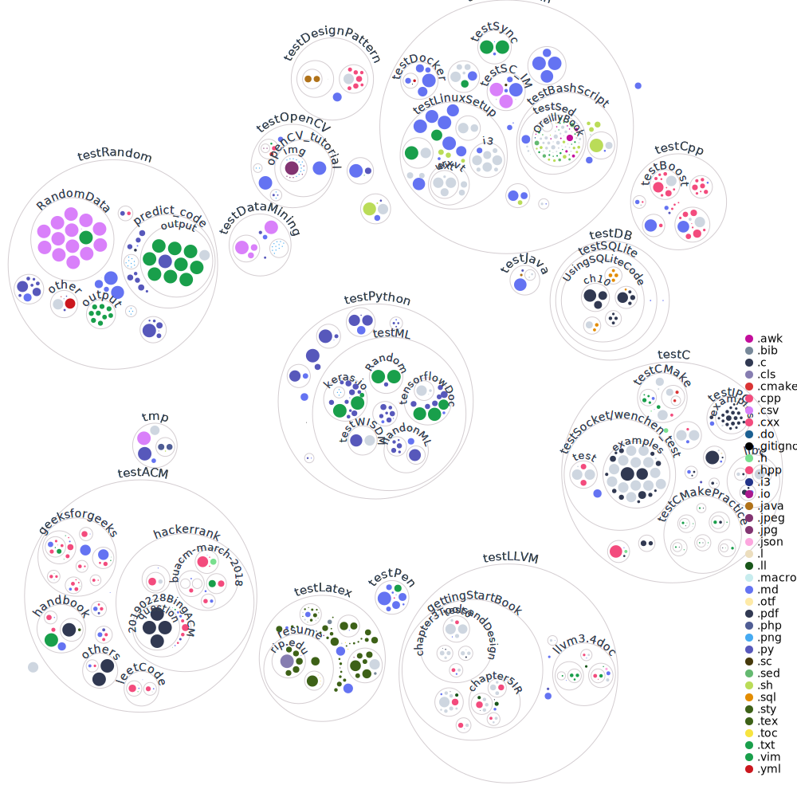

test
================================================================================

This repo is essentially a playground for me.
Mainly log my journey in various tech fields.
I would try my best to keep them in order and make it easy for me to refer back.
This is not meant to be a tutorial repository although that is the direction I wanna go.

Here's some interesting ones:

| Name | Desc | Note |
|:-----|:-----|:-----|
| Vim | Editor of choice. While having deep learning curve, it satisfies all my editor requirements, introduces a new way of using computers, and makes me wanna apply its concept everywhere. | config file: ./testLinuxSetup/vim/ |
| tmux | Terminal multiplexer. I read it as "Terminal Must". Nice terminal multitasks tool. | config file in: ./testLinuxSetup/tmux.conf |
| LaTeX | Better typeset system for essay and presentation. No MS Word and MS PowerPoint except when teamwork requires such applications. Fun of Google doc, easy collaboration tool. | |
| scim  | An unpopular spreadsheet calculator. It is vim-like, TUI based, and provide enough functionalities for my daily use. | |
| testCpp etc. | Like C/CPP programming. while complicate, it provides unique features and functunalities, like macro, working well with assembly, could go both low level and high level. Plus some great libs and tools developed around this community. Just enjoy it. | |
| testLLVM | Next gen C/CPP compiler. Big fan of its new compile concept. | |
| testACM | working on process, need a space for programming questions from several sources. | |
| testSysAdmin | Since I live most of my professional time in *inux environment and command line is such an essential part, learning and using some utilities is inevitable. | |
| testPython | Quick code and data analysis. Simple syntax and great community support make it a must learn language for me. | |
| testPen | PenTest amateur. Only test on my own device for better understanding of security. | Tried Meltdown and Specture, not in this repository though |
| testRandom | A huge question in my head during Spring 2019, and an essential part of encryption and security. A good topic. | |

Meanwhile, there are some great courses I took in SUNY Binghamon.
Some of them are programming chanllenging, some of them are mind opening.
I always appreciate how these courses are carefully designed and
how professors show their skills plus knowledges and lead students into next level of mastering.

| CodeName | Desc    | Note |
|:---------|:--------|:-----:|
| CS547HPC_Chiu     | We did MP&MPI, SIMD, omp, and Neural Network using bare CUDA code. Amazing and mind opening. Also, I am a big fun of Prof. Chiu's "Show it, not tell it " teaching style. | |
| CS540OOP_Chiu     | Prof.Chiu's course is like the last few chapters of techBook that most students would ignore yet contain highly beneficial content. | |
| CS558Security_Yan | We did meltdown&specture attack demo, reviewed dozens of general attack methods, and solved the big question of mine about PRNG. While this course didn't make me a CTF boy, it embeds "Hack the planet" idea in my mind. | |
| CS220Arch_Prakash | Outstanding Linux&C skills with a mix of assembly. Remaining chanllenge and fun, it brought my terminal style to next level. | |
| CS520Arch_Ghose   | Obsolutely great course. It is the first time I would regard one's teaching material as gold mine. Even better, it requires you to build the CPU simulator from ground, making these concepts vivid and unforgettable. | |
