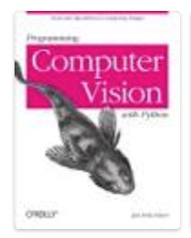
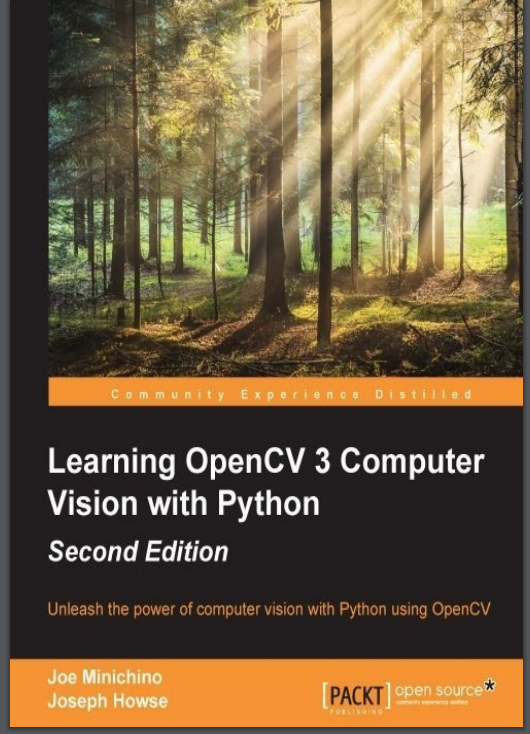

I don't even remember when I started this fold.
for me, right now, data analysis is more important and design pattern is another topic to study.
learning this topic for fun.

log
================================================================================

"programming computer vision with python", 2012
is outdated



"learning openCV 3 computer vision with python" , second edition, 2015
================================================================================



[source code](https://github.com/mo-cv/pycv)

this pdf is not copy-friendly.

chapter 01 setting up openCV
--------------------------------------------------------------------------------

ENGLISH: leverage the immense potential of OpenCV

sadly, using python2.7

[official source code](https://github.com/techfort/pycv)

Github Pages and Github Books are cool, may check them out

may check out VisualBox, VMware is the best based on web discussion

may check out MacPort

I might need to use a Linux (Ubuntu/CentOS)to do my programming work

SciPy contains some Fortran code, really??

sadly, I install python2 in my local MacOS using "brew install python2"

now, I know why I need to VM is be my test environment.
I think I am messing around my environment
```shell
    brew install python2
    pip2 install numpy
    pip2 install scipy
    brew install opencv
    pip2 install ipython
```

And don't update my daily working machine(namely macOS or others),
Apple would push a great system upgrade and break others' code

[sample code](https://github.com/opencv/opencv)

chapter 02 Handling Files, Cameras, and GUIs
================================================================================

check the src code in pycv

cv2.imshow("w1", image) # not working in macOS

well, consdiering that python2 is dieing,
and openCV API changing, most call don't make sense in my machine
quit following this book
